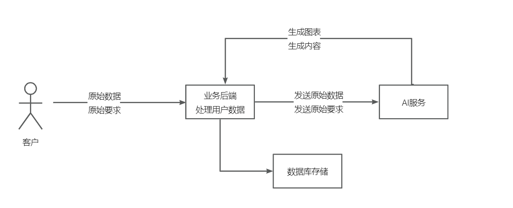
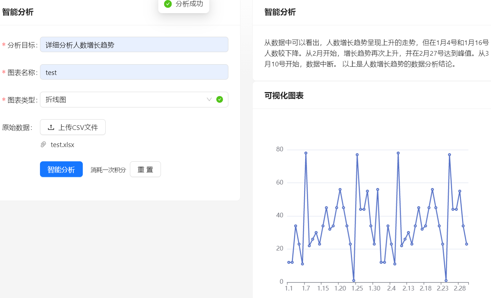
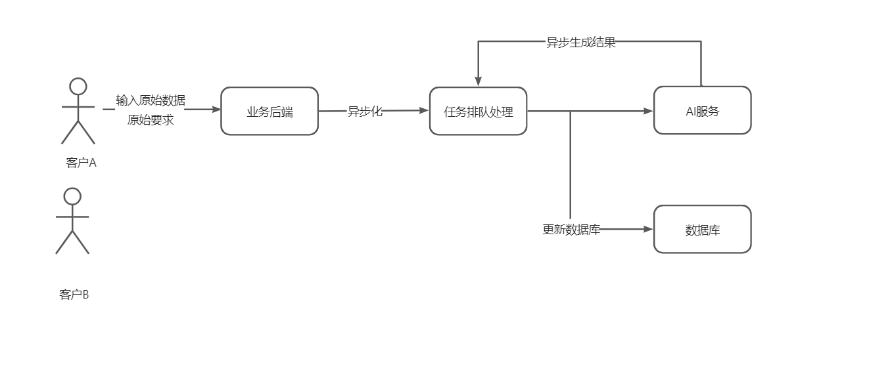
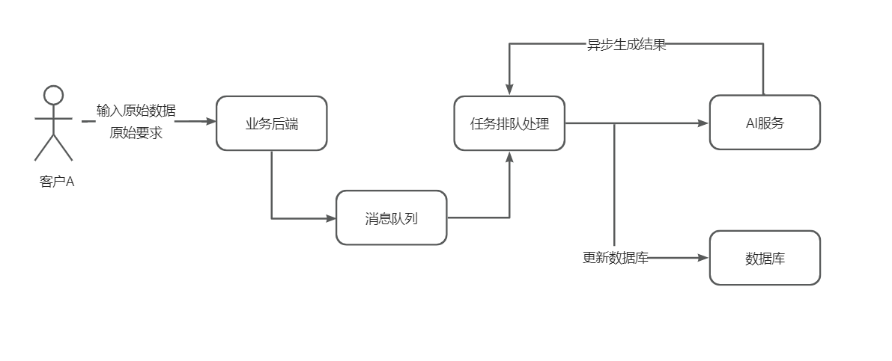
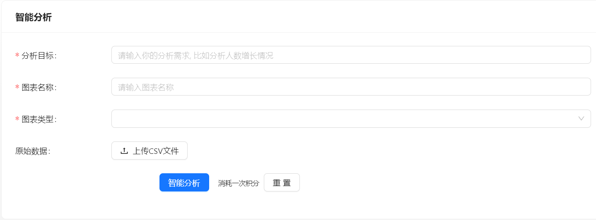
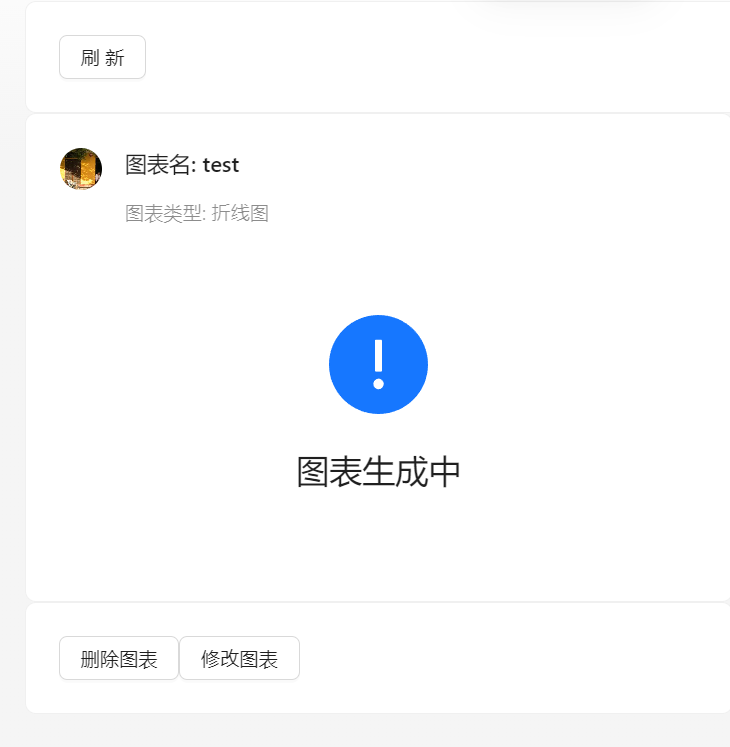

# 飞云 BI

区别于传统BI，用户只需要导入原始数据集、并输入分析诉求，就能自动生成可视化图表及分析结论，实现数据分析的降本增效。

### 主流框架

- Spring Boot 2.7.4
- Spring MVC
- MyBatis + MyBatis Plus 数据访问（开启分页）
- Spring Boot 调试工具和项目处理器
- Spring AOP 切面编程
- Spring Scheduler 定时任务
- Spring 事务注解
- Redisson 进行限流处理
- 多线程异步化
- Rabbit MQ 消息队列

### 工具类

- Easy Excel 表格处理
- Hutool 工具库
- Gson 解析库
- Apache Commons Lang3 工具类
- Lombok 注解

### 业务特性

- Spring Session Redis 分布式登录
- 全局请求响应拦截器（记录日志）
- 全局异常处理器
- 自定义错误码
- 封装通用响应类
- Swagger + Knife4j 接口文档
- 自定义权限注解 + 全局校验
- 全局跨域处理
- 长整数丢失精度解决
- 多环境配置

## 改进以及业务流程
基础流程

缺点: 等待AI服务调用生成最后结果后才返回，业务请求过多，服务器宕机

改进
采用异步化

缺点：单机部署

进阶流程
采用Rabbit MQ

用户不需要进行等待，

### BI 前端
https://github.com/flybase1/flybi-frontend

## 更新日志
7.5 更新日志
完成服务器相关部署，上线网站
内容包含
- 用户注册登录修改信息
- AI分析模块提交，包含单线程分析，rabbitmq异步分析
- 用户可以提交excel文档，使用AI进行分析
- 用户可以查看自己提交的图表信息
- 管理员可以修改用户权限
- 设置每位用户的调用次数
- 接入第三方服务作为AI模型
- 添加redisson来进行限流处理，避免传输过多造成第三方服务宕机
- 

7.9 跟新日志
- 修改导航，将实时与非实时智能分析从导航栏移除，添加至AI服务界面
- 添加新的业务，管理员可以创建AI模型，用于展示AI服务
- 添加AI服务搜索功能
- 添加新功能，用户可以提交excel表格后，可以选择自己需要的相应属性进行数据分析
- 支持用户查看自己的提交的原数据，以及数据导出
- 添加重试机制，用户可以手动重试将未完成的分析重新提交，重试次数只有三次
- 添加管理图表功能，管理员可以争对异常分析数据进行二次分析
- 添加黑名单机制，用户请求次数过多直接拉黑，无法登入网站
- 若干细节优化

